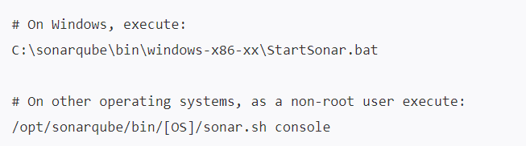
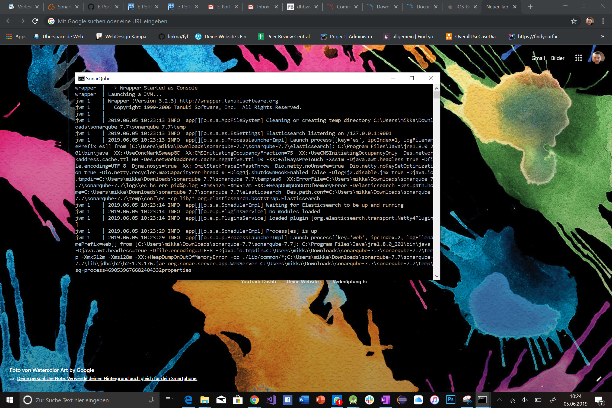
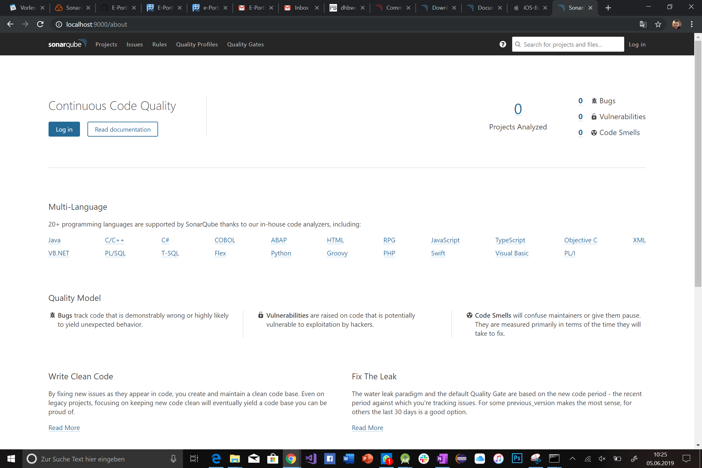
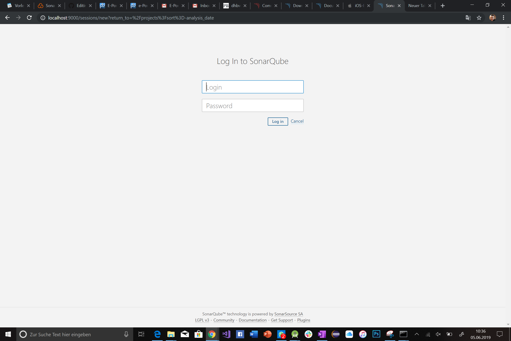
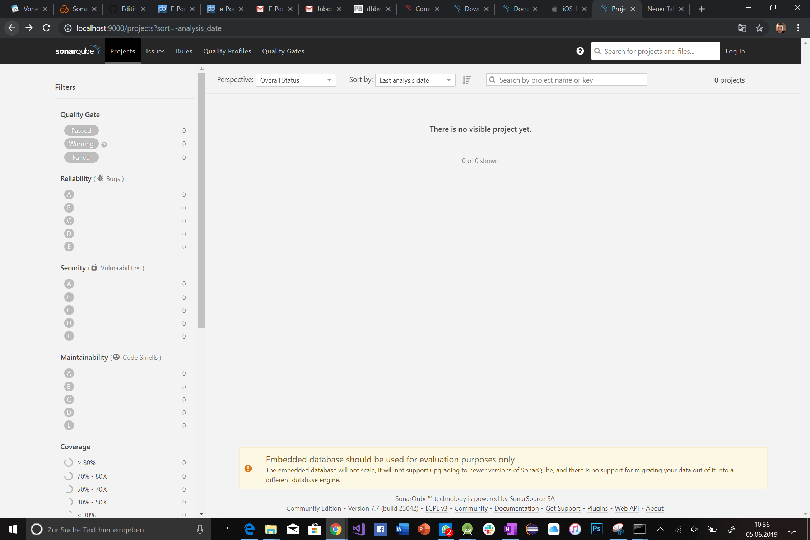

# E-Portfolio-SonarQube

Here are all informations about the e-portfolio, some exercises and solutions of them.

# Sonarqube Hands-on:

It will run on all devices and all IDE´s.

## Content:

Follow the instruction

Content:
- [1. Needed components](#1-login-to-sonarcloud-with-github-account)
- [2. Fork the project](#2-fork-the-project)
- [3. On sonarcloud select the repository you will check with sonarqube](#3-on-sonarcloud-select-the-repository-you-will-check-with-sonarqube)
- [4. Setup the join between IDE and sonarcloud](#4-setup-the-join-between-IDE-and-sonarcloud)
- [5. See what your code is about](#5-see-what-your-code-is-about)

So after this steps you can handle your code quality and see what you can do better or what is almost good.

# 1. Needed components

To work with the tutorial make sure you follow the steps below or [here](#https://docs.sonarqube.org/latest/setup/get-started-2-minutes/).

#### 1. Download the SonarQube Community Edition [here](#https://www.sonarqube.org/downloads/) 
#### 2. Unzip it
#### 3. Start the SonarQube Server

#### 4. Log in to http://localhost:9000 with System Administrator credentials (admin/admin)
#### 5. Download MySQL / make sure to have it [MySQL-Downlaod](#https://dev.mysql.com/downloads/)
#### 6. Make sure to use Java 11
#### 7. Last one, make sure to have SonarQube Scanner and Server

# 2. fork the project

If you want to see your quality of code fork the project from your Software engineering project to have full access.

# 3. prepare your IDE and Gradle
In our example we analyze the code with gradle, because the project runs with gradle.
Read the steps on the [website](#https://docs.sonarqube.org/display/SCAN/Analyzing+with+SonarQube+Scanner+for+Gradle) or read below.

Add the following code snippet in your gradle.properties ->

"systemProp.sonar.host.url=http://localhost:9000
#----- Token generated from an account with 'publish analysis' permission
systemProp.sonar.login=<token>"
Also add to global build.gradle -> 
"plugins {
  id "org.sonarqube" version "2.7.1"
}"

# 4 follow the instruction of sonarqube

When you start the StartSonar.bat the following command will occure.

Then you go back to the http://localhost:9000 and sonarqube will laod the page.

 When it is finished it shows the start page.

 After that you must login to sonarqube to run the code analyze.
 
 
 
 Then you must setup you repo from github in sonarqube in this page.
 
 
 
