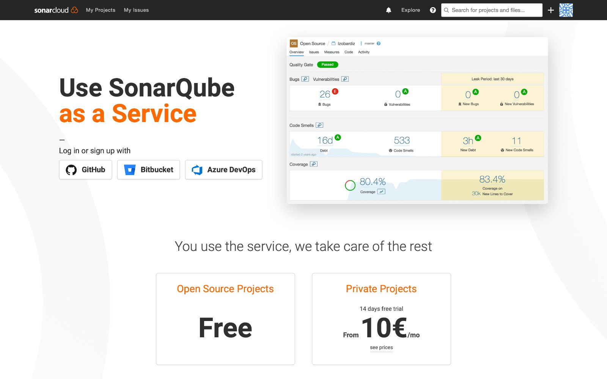
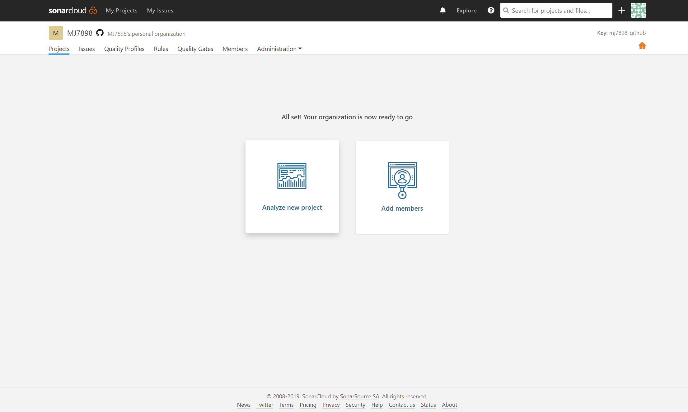
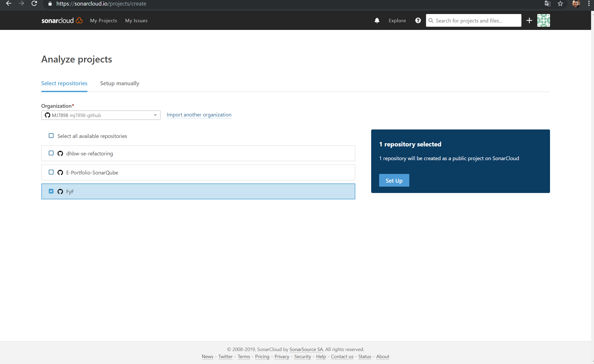
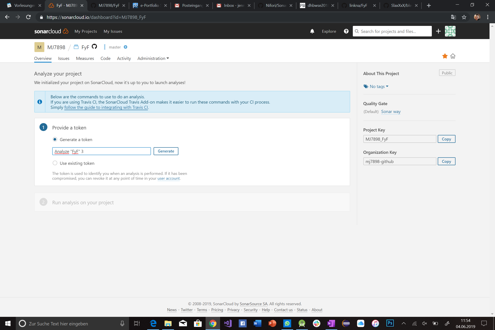
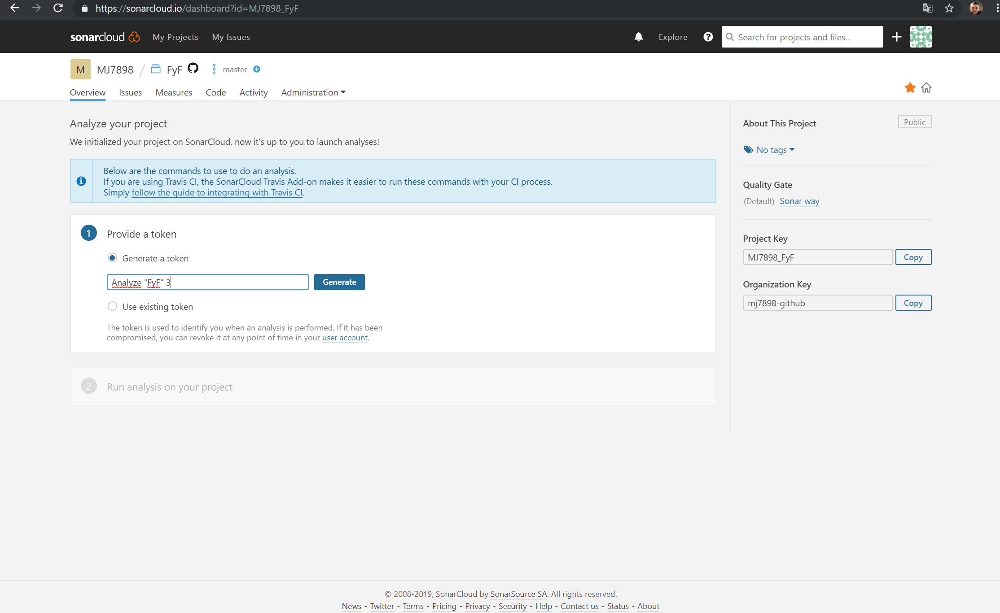
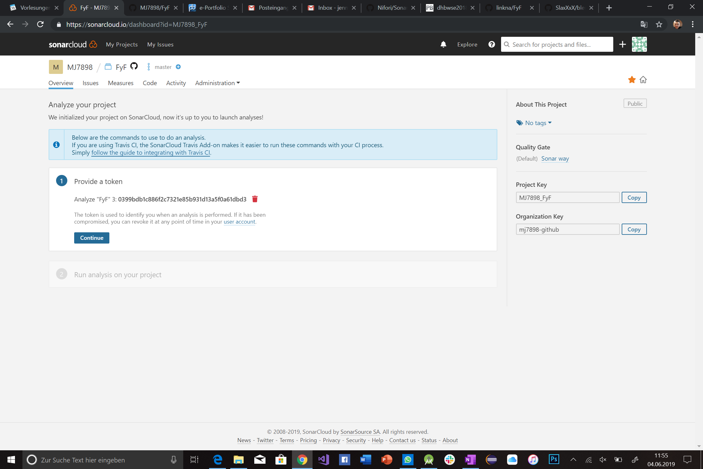
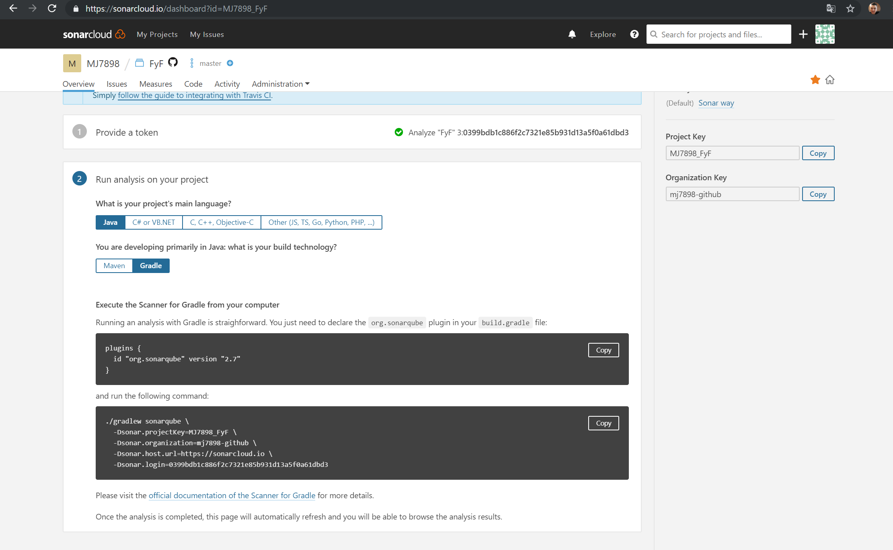

# E-Portfolio-SonarQube
Here are all informations about the e-portfolio, some exercises and solutions of them.
# Sonarqube / Sonarcloud Hands-on:
## Content:
Follow the instruction

It will run on all devices and all IDE´s.

Content:
- [1. Login to sonarcloud with github account](#1-login-to-sonarcloud-with-github-account)
- [2. If the Repo or Project is not yours, fork it in your account](#2-if-the-repo-or-project-is-not-yours,-fork-it-in-your-account)
- [3. On sonarcloud select the repository you will check with sonarqube](#3-on-sonarcloud-select-the-repository-you-will-check-with-sonarqube)
- [4. Setup the join between IDE and sonarcloud](#4-setup-the-join-between-IDE-and-sonarcloud)
- [5. See what your code is about](#5-see-what-your-code-is-about)

So after this steps you can handle your code quality and see what you can do better or what is almost good.

# 1. Login to conarcloud.io with github account

# 2. fork the project

# 3. select the right repository

# 4 follow the instruction of sonarcloud

